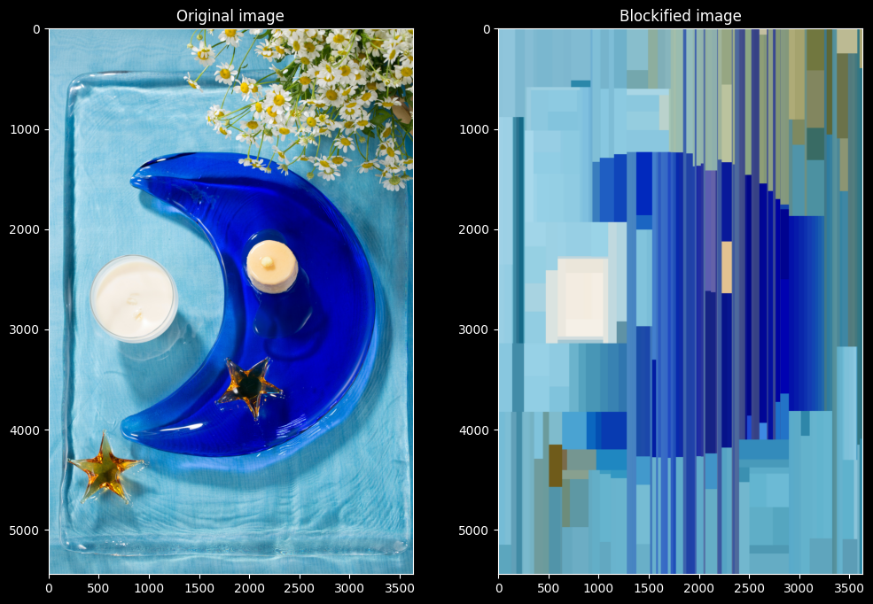

# blockify.py

`blockify.py` is a Python library that decomposes an image into rectangular blocks
of solid color. Its intended use is to compute very lightweight SVG approximations
to an input image that can be displayed while the image is loading.

Inspired by <https://github.com/fogleman/primitive>, but `blockify.py` chooses a different
set of tradeoffs. In particular, by partitioning the image into nonoverlapping "panes"
instead of allowing transparent, intersecting polygons, we sacrifice fidelity to the original
image in favor of a truly small filesize in the vector approximation and fast computation time.

## Examples

## How it works

To split an image horizontally into two panes (left and right):

- For each possible split between `0` and the image's width, compute the sum of squared deviations between each pixel hue and the average hue within the left and right panes.
- Choose the value that minimizes the sum of the squared deviations between the left and right panes.
- Replace pixels to the left (right) of the split point with the average hue in the left (right) pane.

Splitting an image vertically is analogous.

To decompose an image into `n` panes, we apply the "split an image" routine recursively, alternating between horizontal and vertical splits. There are many possible strategies for selecting which pane to split next:
- The "variance" strategy splits the pane that has the highest squared deviation from its average hue (i.e., the highest variance weighted by the pane area)
- The "largest pane" strategy (not yet implemented) always splits the pane of largest area.

## Attribution

The test images are from <a href="https://unsplash.com/@lvenfoto?utm_source=unsplash&utm_medium=referral&utm_content=creditCopyText">Zhang liven</a> on <a href="https://unsplash.com/?utm_source=unsplash&utm_medium=referral&utm_content=creditCopyText">Unsplash</a>.